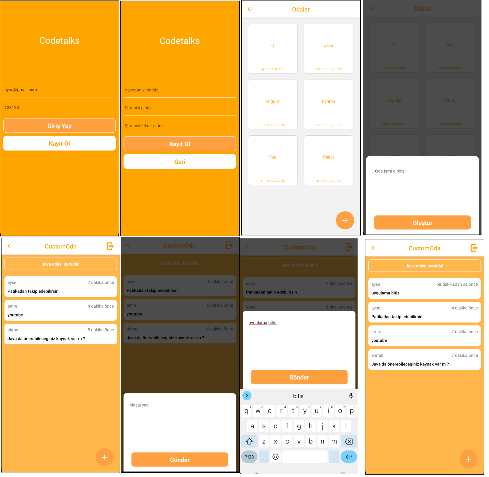

# React Native Patika CodeTalks App
The project is a mobile application that allows users to chat with each other. The application is developed with React Native and Firebase. The application has a login and register screen. Users can register with their e-mail and password. After registration, users can log in with their e-mail and password. Users can chat with each other after logging in. Users can send messages to each other.


## Features
- User can register with e-mail and password.
- User can log in with e-mail and password.
- User can send messages to each other.
- User can see the messages they send and receive.
- User can see the date and time of the messages they send and receive.


## Screenshots



## Installation

To run the Todo app on your local machine, you need to have Node.js and npm installed. You also need to have an Android or iOS emulator installed on your computer or a physical device connected to your computer. Follow these steps to install and run the application:

1. Clone the repository:

   ```bash
   git clone https://github.com/yusufie/react-native-patika-codetalks.git
    ```

2. Navigate to the project directory:

   ```bash
   cd react-native-patika-codetalks
   ```

3. Install the dependencies:

   ```bash
    npm install
    ```

4. Run the development server:

   ```bash
   npm run start
   ```

6. Run the application on an emulator or a physical device:

   ```bash
   npm run android
   ```

   or

   ```bash
   npm run ios
   ```

Open the emulator or connect your physical device to your computer to run the application. The application will be automatically installed and launched on the device.


## Packages
- npm install --save @react-native-firebase/app
- npm install --save @react-native-firebase/auth
- npm install --save @react-native-firebase/database
- npm install --save react-native-flash-message
- npm i react-native-modal
- npm install date-fns --save
- npm install --save react-native-vector-icons

## For package installation, you must follow the steps at these addresses.

### ---------------------Icons----------------------
- https://github.com/oblador/react-native-vector-icons
- https://oblador.github.io/react-native-vector-icons/

### ---------------------Firebase----------------------
- https://rnfirebase.io/auth/usage/installation/android


## Contributing

Contributions are welcome! If you find any issues or have suggestions for improvements, please open an issue or submit a pull request. Follow these steps to contribute:

1. Fork the repository.
2. Create a new branch for your feature or bug fix.
3. Make the necessary changes and commit those changes.
4. Push your code to your forked repository.
5. Submit a pull request describing the changes you made.

Please make sure to follow the existing code style and conventions.
